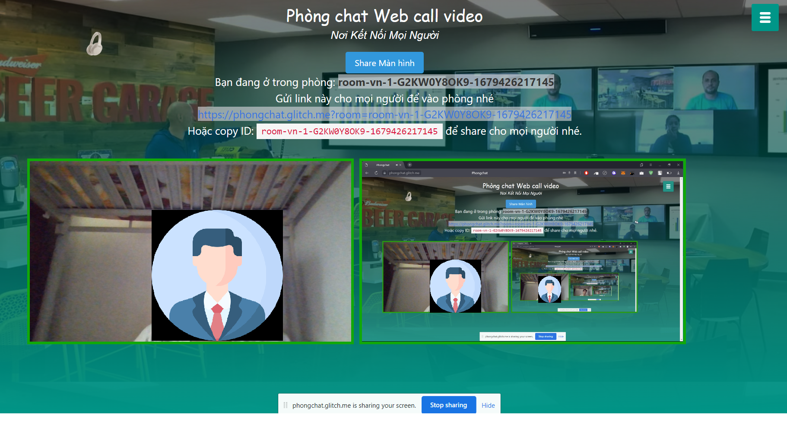

# Web 1 - Website video call


 

## Thành viên nhóm

| STT |    MSSV    | Họ và tên             |
| :-: | :--------: | --------------------- |
|  1  | 3119410420 | Hồ Tấn Thuận          |
|  2  | 3119410439 | Minh Hiếu Calan Tog   |
|  3  | 3119410321 | Nguyễn Thị Phượng     |
|  4  | 3119410292 | Nguyễn Lê Tâm Như     |
|  5  | 3119410293 | Huỳnh Như             |

## Yêu Cầu:

- Xây dựng giao diện website, có sử dụng API Stringee để sử dụng chức năng video call <br/>


## Hướng dẫn cài đặt

Phần mềm chạy tốt với độ phân giải màn hình chuẩn của máy là > 1280x900 ( FullHD )

```
1. Upload code lên server có chứng chỉ SSL (ở đây nhóm sử dụng "glitch.com" làm nơi lưu trữ code).
```

```
2. Chạy web bằng file index.html
```
## Link demo: https://tanthuan.glitch.me/

## Một số giao diện của website




